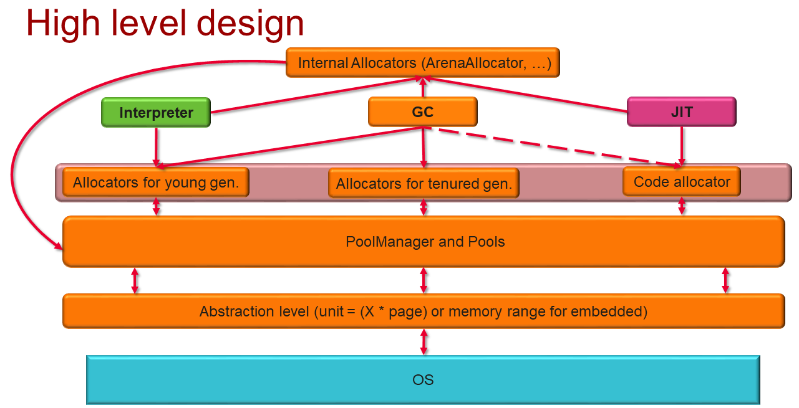

# Memory Management and Object Layout

## Overview

Panda Runtime should be scalable onto different devices/OSs. So we need some abstraction levels for the OS memory management.
For now, all targets are supposed to interact with users, so we put some limitations for the STW pause metric.
We have very limited memory resources for IoT target, so we should maximize efforts on reducing memory overhead (fragmentation and object header size).

The main components of Panda memory management and object model:
* [Allocators](#allocators)
* [GC](#gc)
* [Object header](#object-header)

Panda Runtime works/interacts with these memory types:
* internal memory for Runtime (ArenaAllocators for JIT, etc)
* application memory (i.e., memory for objects created by applications)
* native memory via JNI/FFI
* memory for JITed code



There are several modes for memory management:
- base mode
  - allocators with some average metrics and profile-based configurations (if available)
  - some baseline GCs with profile-based configurations (if available)
- performance
  - allocators with low allocation cost
  - low-pause/pauseless GCs (for games) or GCs with high throughput and acceptable STW pause (not for games)
- power-saving mode
  - energy-efficient allocators (if possible)
  - special thresholds to improve power efficiency

Modes are chosen at the startup time (we'll use profile info from cloud for that).

### Requirements

* Supporting all required features from Runtime
* Similar design for two different platforms (high-end and low-end)
* Compact object headers for low-end targets

### Specification/Implementation

**Common ObjectHeader methods:**

* Get/Set Mark or Class Word
* Get size of the object header and an object itself
* Get/Generate an object hash

**Methods, specific for Class Word:**

* Get different object fields.
* Return the object type.
* Verify the object.
* Check whether it is a subclass or whether it is an array, etc.
* Get field addresses.

**Methods, specific for Mark Word:**

* Object locked/unlocked
* Marked for GC or not
* Monitor functions (get monitor, notify, notify all, wait)
* Forwarded or not

Mark Word depends on configuration and can have different sizes and layouts. So here all possible configurations:

128-bit object header for high-end devices (64-bit pointers):
```
|--------------------------------------------------------------------------------------|--------------------|
|                                   Object Header (128 bits)                           |        State       |
|-----------------------------------------------------|--------------------------------|--------------------|
|                 Mark Word (64 bits)                 |      Class Word (64 bits)      |                    |
|-----------------------------------------------------|--------------------------------|--------------------|
|               nothing:61          | GC:1 | state:00 |     OOP to metadata object     |       Unlock       |
|-----------------------------------------------------|--------------------------------|--------------------|
|    tId:29    |      Lcount:32     | GC:1 | state:00 |     OOP to metadata object     |  Lightweight Lock  |
|-----------------------------------------------------|--------------------------------|--------------------|
|               Monitor:61          | GC:1 | state:01 |     OOP to metadata object     |  Heavyweight Lock  |
|-----------------------------------------------------|--------------------------------|--------------------|
|                Hash:61            | GC:1 | state:10 |     OOP to metadata object     |       Hashed       |
|-----------------------------------------------------|--------------------------------|--------------------|
|           Forwarding address:62          | state:11 |     OOP to metadata object     |         GC         |
|-----------------------------------------------------|--------------------------------|--------------------|
```
64-bit object header for high-end devices (32-bit pointers):
```
|--------------------------------------------------------------------------------------|--------------------|
|                                   Object Header (64 bits)                            |        State       |
|-----------------------------------------------------|--------------------------------|--------------------|
|                 Mark Word (32 bits)                 |      Class Word (32 bits)      |                    |
|-----------------------------------------------------|--------------------------------|--------------------|
|               nothing:29          | GC:1 | state:00 |     OOP to metadata object     |       Unlock       |
|-----------------------------------------------------|--------------------------------|--------------------|
|    tId:13    |      Lcount:16     | GC:1 | state:00 |     OOP to metadata object     |  Lightweight Lock  |
|-----------------------------------------------------|--------------------------------|--------------------|
|               Monitor:29          | GC:1 | state:01 |     OOP to metadata object     |  Heavyweight Lock  |
|-----------------------------------------------------|--------------------------------|--------------------|
|                Hash:29            | GC:1 | state:10 |     OOP to metadata object     |       Hashed       |
|-----------------------------------------------------|--------------------------------|--------------------|
|           Forwarding address:30          | state:11 |     OOP to metadata object     |         GC         |
|-----------------------------------------------------|--------------------------------|--------------------|
```

However, we can also support such version of the object header (Hash is stored just after the object in memory if object was relocated):
```
|--------------------------------------------------------------------------------------|--------------------|
|                                   Object Header (64 bits)                            |        State       |
|-----------------------------------------------------|--------------------------------|--------------------|
|                 Mark Word (32 bits)                 |      Class Word (32 bits)      |                    |
|-----------------------------------------------------|--------------------------------|--------------------|
|        nothing:28        | Hash:1 | GC:1 | state:00 |     OOP to metadata object     |       Unlock       |
|-----------------------------------------------------|--------------------------------|--------------------|
|  tId:13  |   LCount:15   | Hash:1 | GC:1 | state:00 |     OOP to metadata object     |  Lightweight Lock  |
|-----------------------------------------------------|--------------------------------|--------------------|
|        Monitor:28        | Hash:1 | GC:1 | state:01 |     OOP to metadata object     |  Heavyweight Lock  |
|-----------------------------------------------------|--------------------------------|--------------------|
|   Forwarding address:28  | Hash:1 | GC:1 | state:11 |     OOP to metadata object     |         GC         |
|-----------------------------------------------------|--------------------------------|--------------------|
```
This scenario decreases the size of a Monitor instance, and we don't need to save Hash somewhere during Lightweight Lock.
Unfortunately, it requires extra memory after GC moved the object (where the original hash value will be stored) and also requires extra GC work.
But, this scenario will be useful if we have allocators and GC which decreases such a situation to a minimum.

32-bit object header for low-end devices:
```
|--------------------------------------------------------------------------------------|--------------------|
|                                   Object Header (32 bits)                            |        State       |
|-----------------------------------------------------|--------------------------------|--------------------|
|                 Mark Word (16 bits)                 |      Class Word (16 bits)      |                    |
|-----------------------------------------------------|--------------------------------|--------------------|
|               nothing:13          | GC:1 | state:00 |     OOP to metadata object     |       Unlock       |
|-----------------------------------------------------|--------------------------------|--------------------|
|    thread Id:7    | Lock Count:6  | GC:1 | state:00 |     OOP to metadata object     |  Lightweight Lock  |
|-----------------------------------------------------|--------------------------------|--------------------|
|               Monitor:13          | GC:1 | state:01 |     OOP to metadata object     |  Heavyweight Lock  |
|-----------------------------------------------------|--------------------------------|--------------------|
|                Hash:13            | GC:1 | state:10 |     OOP to metadata object     |       Hashed       |
|-----------------------------------------------------|--------------------------------|--------------------|
|         Forwarding address:14            | state:11 |     OOP to metadata object     |         GC         |
|-----------------------------------------------------|--------------------------------|--------------------|
```

States description:

Unlock - The object is not locked.

Lightweight Lock – The object is locked by one thread.

Heavyweight Lock - A few threads compete to lock this object.

Hashed - The object has been hashed, and hash has been stored inside Mark Word.

GC - The object has been moved by the GC.

## String and Array Representation

Array:
```
+------------------------------------------------+
|             Object Header (64 bits)            |
|------------------------------------------------|
|                Length (32 bits)                |
|------------------------------------------------|
|                  Array payload                 |
+------------------------------------------------+
```
String:

If we don't use strings compressing, each string has this structure:
```
+------------------------------------------------+
|             Object Header (64 bits)            |
|------------------------------------------------|
|                Length (32 bits)                |
|------------------------------------------------|
|           String hash value (32 bits)          |
|------------------------------------------------|
|                  String payload                |
+------------------------------------------------+
```
If we use strings compressing, each string has this structure:
```
+------------------------------------------------+
|             Object Header (64 bits)            |
|------------------------------------------------|
|                Length (31 bits)                |
|------------------------------------------------|
|             Compressed bit (1 bit)             |
|------------------------------------------------|
|           String hash value (32 bits)          |
|------------------------------------------------|
|                  String payload                |
+------------------------------------------------+
```
If the compressed bit is 1, the string has a compressed payload, and the payload consists of 8 bits.

If the compressed bit is 0, the string has not been compressed, and the payload consists of 16 bits.

One of the ideas about string representation is to use a hash state inside Mark Word as a container for the string hash value (of course we should save object hash somewhere else if it is needed or should use the string hash value as the object hash value).

String:
```
+------------------------------------------------+
| String Hash | GC bit (1 bit) | Status (2 bits) |    <--- Mark Word (32 bits)
|------------------------------------------------|
|              Class Word (32 bits)              |
|------------------------------------------------|
|                Length (32 bits)                |
|------------------------------------------------|
|                  String payload                |
+------------------------------------------------+
```

## Allocators

Requirements:
- simple and effective allocators for JIT
  - free of manual memory cleanup
  - efficient all at once deallocation to improve performance
- reasonable fragmentation
- scalable
- support for pool extension and reduction (i.e., we can add another memory chunk to the allocator, and it can give it back to the global "pool" when it is empty)
- cache awareness

*(optional) power efficiency

All allocators should have these methods:
- method which allocates ```X``` bytes
- method which allocates ```X``` bytes with specified alignment
- method which frees allocated memory pointed by pointer (ArenaAllocator is an exception)

### Arena Allocator

It is a region-based allocator, i.e., all objects allocated in region/arena can be efficiently deallocated all at once.
Deallocation for the specific object doesn't have effect in this allocator.

JIT flow looks like this:
```
IR -> Optimizations -> Code
```

After code generation, all internal structures of JIT should be deleted.
So, if we can hold JIT memory usage at some reasonable level, arena allocators ideally fit JIT requirements.

### Code Allocator

Requirements:
- should allocate executable memory for JITed code

This allocator can be tuned to provide more performance.
For example, if we have some callgraph info, we can use it and allocate code for connected methods with a minimized potential cache-collision rate.

### Main Allocator

Requirements:
- acceptable fragmentation
- acceptable allocation cost
- possibility to iterate over the heap
- scalable
Desired:
- flexible allocation size list (required to support profile-guided allocation to improve fragmentation and power efficiency)

#### Implementation details

Each allocator works over some pools.

Size classes (numbers are just informational and will be tuned after performance analysis):
- small (1b-4Kb)
- large (4Kb - 4Mb)
- humongous (4Mb - Inf)

A size-segregated algorithm is used for small size class to reduce fragmentation.
Small objects are joined in "runs" (not individual element for each size, but some "containers" with X elements of the same size in it).
```
+--------------------------------------+-----------------+-----------------+-----+-----------------+
| header for run of objects with size X| obj with size X | free mem size X | ... | obj with size X |
+--------------------------------------+-----------------+-----------------+-----+-----------------+
```

Large objects are not joined in "runs".

Humongous objects can be allocated by simply proxying requests to the OS (but keeping reference to it somewhere) or by using special allocators.

_Note: The following is intended for non-embedded targets_

Each thread maintains a cache for objects (at least for all objects with small size).
This should reduce overhead because of synchronization tasks.

Locking policy:
- locks should protect localized/categorized resources (for example one lock for each size in small size class)
- avoid holding locks during memory related system calls (mmap etc.)

#### Profile-guided allocation

We can use profile information about the allocation size for improving main allocator metrics.
If we see a very popular allocation size in the profile, we can add it as an explicit segregated size and reduce fragmentation.
To make it work, allocators should support the dynamic size table or can choose a statically predefined size.

## Pools and OS Interactions

All used memory is divided in chunks. A main allocator can extend its pool with these chunks.

In case of memory shortage, we should have some preallocated buffers which allow Runtime to continue to work, while GC is trying to free memory.

Note:
IoT systems without MMU pools should have non-trivial implementation.

Note:
For some systems/languages, a context-scoped alloccator should be implemented.
This allocator works over some arena and returns this arena to the OS if the program runs out of the context.

## Spaces

- MemMapSpace, shared between these:
  - Code space (executable)
  - Compiler Internal Space (linked list of arenas)
  - Internal memory space for non-compiler part of Runtime (including GC internals)
  - Object space
     - BumpPointerSpace
     - Regular object space
     - Humongous objects space
     - TLAB space (optional)
     - RegionSpace (optional for some GCs)
     - Non-moving space
- MallocMemSpace
  - Humongous objects space (optional)

Logical GC spaces:
- young space (optional for some GCs)
- survivor space (optional)
- tenured space

## GC

Garbage collector (GC) automatically recycles memory that will never be used again.

GC is developed iteratively.

Common requirements:
- precise GC (see [glossary](./glossary.md#memory-management-terms))
- GC should support various [modes](#overview)(performance, power-saving mode, normal mode)
- GC suitable for each mode and compliant with this mode (see [here](#overview))

Requirements for Runtime:
- support for precise/exact roots
- GC barriers supported by Interpreter and JIT
- safepoints supported by Interpreter and JIT

Panda should support multiple GCs, since different GCs have different advantages (memory usage, throughput) at different benchmarks/applications.
So we should have possibility to use a suitable GC for each application.

### Epsilon GC

Epsilon GC does absolutely nothing but makes the impression that Runtime has GC. I.e., it supports all required GC interfaces and can be integrated into Runtime.

Epsilon GC should be used only for debug and profiling purposes. I.e., we can disable GC and measure in mode "What if we don't have GC".

### STW GC

Stop-The-World (STW) GC is a non-generational non-moving GC. During its work all mutator threads should be at safepoint.

1. Root scan
2. Mark
3. Sweep

### Concurrent Mark Sweep GC

Requirements:
- concurrent
- generational
- low CPU usage (high throughput)
- acceptable STW pause
- (optional) compaction

We need to conduct more performance analysis experiments for choosing a better scheme, but for now let's consider these options:
- generational moving (optionally compacting) GC
- (optional) generational non-moving (optionally compacting) GC

Spaces (for moving CMS):
```
+------------+------------+----------------------------+
| Eden/young |  Survivor  |        Tenured/old         |
|            | (optional) |                            |
+------------+------------+----------------------------+
```

Survivor space is optional and only for high-end targets.
Since one of the metric for this GC - high throughput, most objects in the Eden will live long enough before death.
If we prioritize energy-efficiency metric and the heap sizes at average are not gigantic, we should avoid using survivor spaces.
So we can support it optionally for experiments. As an alternative, we can introduce some average age metadata for run of small objects.

Minor GC (STW):
1. Root scan for young generation, CardTable used for finding roots in old generation
1. Mark Eden and move alive objects to the tenured (or survivor)
1. Sweep Eden

Note: We'll use adaptive thresholds for triggering Minor GC for minimizing the STW pause.
Note #2: We can tune Minor GC by trying make concurrent marking and re-mark, but it will require copy of the card table.

Major GC:
1. Concurrent scan of static roots
1. Initial Mark - root scan (STW #1)
1. Concurrent Marking + Reference processor
1. Remark missed during concurrent marking objects (STW #2)
1. Concurrent Sweep + Finalizers
1. Reset

Reference processor - prevents issues with wrong finalization order.

Note: If we don't have Survivor spaces we can implement non-moving generational GC.

### Region based GC (main)

Requirements:
- concurrent
- generational
- acceptable stable STW pause
- (optional) compaction

Since the typical heap size for mobile applications is small, this GC can be considered as a good choice for production.

All heaps should consist of memory regions with fixed sizes (which can be modified, i.e. size of memory region #K+1 can be different than size of memory region #K).
```
+------------------+------------------+-----+------------------+
| Memory region #1 | Memory region #2 | ... | Memory region #N |
| young            | tenured          | ... | tenured          |
+------------------+------------------+-----+------------------+
```

Regions types:
- young regions
- tenured regions
- humongous regions (for humongous objects)
- empty regions

Incoming references for each region are tracked via remembered sets:
- old-to-young references
- old-to-old references

Minor GC (only for young regions - STW):
1. Root scan for young generation, remembered sets used for finding roots in old generation
1. Marking young generation + Reference processor + moving alive objects to the tenured space
1. Sweep + finalizers

The size of the young space to be selected should satisfy:

Mixed GC - Minor GC + some tenured regions added to the young generation regions after the concurrent marking.
Concurrent marking (triggered when the tenured generation size reaches the set threshold):
1. Root scan (STW #1)
1. Concurrent marking + Reference processor
1. Re-mark - finishes marking and updates liveness statistics (STW #2)
1. Cleanup - reclaims empty regions and determines if we need mixed collections to reclaim tenured space. Tenured regions are selected by using different thresholds.

Note: RSets optionally can be refined with special threads

### Low-pause GC (deferred)

Requirements:
- stable low STW pause/pauseless
- (optional) incremental
- with compaction

No explicit Minor GC.

Major GC:
1. Concurrent scan of static roots
1. Initial Mark - root scan (STW #1)
1. Concurrent Marking + Reference processor
1. Concurrent Sweep + Finalizers + Concurrent Copy & Compact
1. Reset

Note: This GC is suitable for the applications with a big heap or for applications when it is hard to provide a stable low pause with region based GCs.

Note: Compaction is target and mode dependent. So for low-memory devices we can consider [semi-space compaction](./glossary.md#memory-management-terms).
For straight-forward approach, we can consider some support from OS to minimize overlapping of semi-space compaction phases between applications.

### GC: interaction with Interpreter, JIT and AOT

#### Safepoints

Prerequisites:
* One HW register is reserved for the pointer to the ExecState (per-thread state). Let's call it `RVState`
* ExecState structure has fields with addresses of some page used for safepoints. Let's call the offset `SPaddrOffset`

In general, safepoint will be just presented as some implicit or explicit load from the `[RVState, SPaddrOffset]`.
For example, it can be something like this: `LDR R12, [RVState, #SPaddrOffset]`

Note: In some architectures it is make sense to use store instead of load because it requires less registers.

Note: If no MMU is available, it is allowed to use explicit conditions for safepoint, i.e. something like this (pseudocode):
```
if (SafepointFlag == true) {
    call Runtime::SafepointHandler
}
```

When GC wants to stop the world, it forces it by stopping all threads at the safepoint.
It protects some predefined safepoint memory page, and it leads to segmentation faults in all execution threads when they do the load from this address.

Safepoints should be inserted at the beginning of the method and at the head of each loop.

For each safepoint, we should have a method that can provide GC with information about objects on the stack.
Interpreter already supports such info in the frames.
But for JIT/compiler, we need JIT- or compiler-generated methods that can get all necessary data for the safepoint.
This method can actually be just some code without prologue and epilogue.
We'll jump to its beginning from signal handler, and in the end, we should jump back to the safepoint, so probably we should put it near the original code.

So the flow looks like this:

```
 ...we need JIT- or compiler-generated methods
 | compiled/jitted code | ------>
 | safepoint #X in the code | ---seg fault--->
 | signal handler | ---change return pc explicitly--->
 | method that prepares data about objects on stack for the #X safepoint and waits until STW ends | ---jump via encoded relative branch to safepoint--->
 | safepoint #X in the code | ---normal execution--->
 | compiled/jitted code | ------>
 ...
```

**Reminder:**
* Consider whether methods are generated for each safepoint or all safepoints at once.

#### GC Barriers

A GC barrier is a block on writing to (write barrier) or reading from (read barrier) certain memory by the application code. GC Barriers are used to ensure heap consistency and optimize some of GC flows.

##### GC Write Barriers

Heap inconsistency can happen when a GC reclaims alive/reachable objects.
I.e. Alive/reachable objects should be reclaimed in the following two conditions:
1. We store reference to a white object into a black object
1. There are no paths from any gray object to that white object

Besides addressing of heap inconsistency problem, write barrier can be used for maintaining incoming references for young generation or region.

So we can solve these issues with GC WRB (write barrier). GC WRB can be _pre_ (inserted before the store) and _post_ (inserted after the store). These barriers are used **only** when we store reference to the object to some fields of an object.

_Pre_ barrier is usually used to solve issue with lost alive object during concurrent marking. Pseudocode (example):
```c++
if (UNLIKELY(concurrent_marking)) {
    auto pre_val = obj.field;
    if (pre_val != nullptr) {
         store_in_buff_to_mark(pre_val); // call function which stores reference to object stored in the field to process it later
    }
}
obj.field = new_val; // STORE for which barrier generated
```

_Post_ barrier can be used to solve issue with tracking references from tenured generation to the young generation (or inter-region references). In this case we always know external roots for the young generation space (or for region). Pseudocode (abstract example, not real one):
```c++
obj.field = new_val; // STORE for which barrier generated
if ((AddressOf(obj.field) not in [YOUNG_GENERATION_ADDR_BEG, YOUNG_GENERATION_ADDR_END]) &&
    (AddressOf(new_val) in [YOUNG_GENERATION_ADDR_BEG, YOUNG_GENERATION_ADDR_END])) {
    update_card(AddressOf(obj.field)); // call function which marks some memory range as containing roots for young generation
}
```
Note: Sometimes we don't check if object and stored reference are in different generations, because we get much less overhead this way.

##### GC Read Barriers

Read barriers used during concurrent compaction in some GCs.
For example, we are concurrently moving object from one place (`from-space`) to another (`to-space`).
At some moment, we may have two instances of the one object.
So either of the following conditions should be met if we want to keep heaps consistent:
1. All writes happen into `to-space` instance of the object, but reads can happen from both `from-space` and `to-space` instances
2. All writes and reads happen into/from `to-space`

#### GC Barriers integration with Interpreter and Compiler


From Interpreter you could use Runtime interface methods:
```c++
static void PreBarrier(void *obj_field_addr, void *pre_val_addr);
static void PostBarrier(void *obj_field_addr, void *val_addr);
```
Note: For performance, we can put into ExecState address of conditional flag for conditional barriers with trivial condition (`if (*x) ...`).

It is critical to make compiler to encode barriers very optimally. At least fast path should be encoded effectively.
There are several approaches for that:
 1. To describe barriers, use some meta-languages or IR which can be interpreted/encoded by all compilers compatible with Runtime (it is currently not applicable for the Runtime).
 1. (A lot of open questions here. So consider this as an idea) One compiler knows how to encode barriers using Runtime interfaces (see next item) and could provide some more compiler-friendly interfaces to the other compilers to encode GC barriers.
 1. The compiler knows how each barrier type should be encoded (see pseudocode in libpandabase/mem/gc_barrier.h), and could use the Runtime to get all required operands to do this.
Let's consider below encoding of PRE_ barrier:
   - get barrier type via RuntimeInterface: `BarrierType GetPreType() const`
   - for this barrier type get all needed operands provided by Runtime via
     `BarrierOperand GCBarrierSet::GetBarrierOperand(BarrierPosition barrier_position, std::string_view name);`
     (you should use operand/parameters names from pseudocode provided in `enum BarrierType`)
   - encode barrier code using loaded operands and pseudocode from `enum BarrierType`

## Memory sanitizers support

Panda Runtime should support [ASAN](https://github.com/google/sanitizers/wiki/AddressSanitizer).

Optional: [MSAN](https://github.com/google/sanitizers/wiki/MemorySanitizer)
(Note: not possible to use without custom built toolchain)

Desirable, but not easy to support: [HWSAN](https://clang.llvm.org/docs/HardwareAssistedAddressSanitizerDesign.html)
